# Capacity Counter  
*Capacity Counter* is a tool for setting and tracking capacity in any situation where a pre-determined finite number of units can be accommodated.  
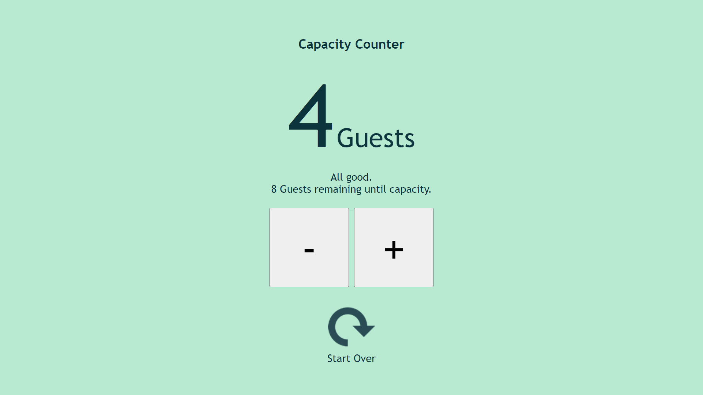

## Contents
1. [Problem Statement](#problem-statement)  
2. [User Stories](#user-stories)
3. [Tech Stack](#tech-stack)  
4. [Design Statement](#design-statement)
5. [Features](#features)
6. [Testing](#testing)
7. [Deployment](#deployment)
8. [Acknowledgements](#acknowledgements)  
  
## Problem Statement  
Limited capacity is a commonplace consideration within event settings, as well as many entertainment, food services and retail settings. In each of these cases, an organisation may have the capacity to accommodate a fixed number of patrons, and tracking the number of patrons already accommodated may be of paramount importance to avoid overcrowding, inability to adequately provide services, and the breach of fire safety regulations.  

While many simple counters exist, few of these possess the option for a user to set their own upper limit and most are designed to count upwards indefinitely. The use of such a tool when dealing with finite numbers creates a number of issues which became particularly apparent during public health restrictions enacted in response to the Covid-19 pandemic which necessitated the widespread use of occupancy-monitoring.

With a background in event management, the developer's goal was to create a tool that could simply and effectively address this problem in an intelligent manner. However, the tool is certainly not limited to use in events, and need not be used to count people but might equally be employed to count a finite resource such as vaccines being administered at walk-in clinics, for example. Similarly, the site might be integrated into an existing UI as part of a suite of tools used within a particular business or environment.
  
## User Stories  
  **Types of User** 
  + Restauranteurs  
  + Entertainment environments with walk-in availablity
  + Transport services  
  + Event Organisers  
  + Clinics, distribution centers and similar settings offering walk-in services dependent on finite resources or limited capacity
  + Employees of the above
  + and more.  
   
     
  **As an organiser, manager or supervisor, I want to...**  
  + Easily track occupancy/resources in a limited-capacity or fixed-resources situation.  
  + Set the parameters for capacity once per use, and not have to consult notes or any additional reminders of the maximum allowable capacity.  
  + Use a UI that allows me to name the units being counted in a way that seems logical and appropriate to my industry (e.g. people, tables, seats, etc.)
  + Hand control of the UI over to a member of staff without needing to relay instructions or explicitly state the maximum allowable capacity to each staff member.  
  
  **As a staff member or other end-user, I want to...**  
  + Track occupancy and capacity without needing to undertake a significant learning curve.
  + Hand control of the UI over to a colleague without the need to explain its functionality, controls or parameters in detail.
  + Use an intuitive system that doesn't visually overwhelm me and allows me to see key information at a glance.
  + Use a system that will remember the maximum capacity for me and negate the need to relay this information to colleagues when taking breaks or changing roles.
  + Be reminded whenever nearing capacity so that I can respond with whatever action might be appropriate in my given situation, such as asking new attendees to wait until others have departed.
  + Have this reminder be appropriate to my situation; for example, a warning 5 units before capacity might be appropriate where the maximum capacity is 50 and less appropriate in a situation where the maximum capacity is 500.
  + Have access to a running count on the number of units remaining before capacity is reached, so that I can make informed decisions and plan ahead; for example, when faced with a group of 10 people wishing to enter an event, I want to know whether capacity is likely to be exceeded by admitting the entire party at this time.
  + Be informed when the event has reached full capacity.
  + Use a system that will not cease to function if capacity is exceeded, whether in reality or through user error, but notifies me of the fact and allows me to correct the situation.  
  
## Tech Stack  
1. Languages
  + HTML
  + CSS
  + Javascript
  
## Design Statement     
As mentioned in the introduction, the UI-design is based on the almost-universally recognised colour-coding used in standard traffic lights across the globe.  As used in the context of traffic lights, the colours red, amber and green represent a method of visual communication that remains constant in the vast majority cultures and jurisdictions, and this convention is easily recognised and readily understood by the general public.  Piggybacking on this preexisting convention and using this colour combination to communicate with the user makes the UI more intuitive for the user.
  
This comparison is also appropriate on the more abstract level, as the counter can be thought of as a finite state machine, much like the commonplace traffic light. In other words, the UI has a finite number of possible states and can only be in one of these states at a given time. The transition between states is prompted by the input the "machine" receives, in this case by way of user-initiated actions.  

Importantly, however, text-based communication is also present for users with any relevant form of colour-blindness, and announcements are made for screenreader users.  
  
## Features  
Capacity Counter asks the user to input some basic information about their goals. Specifically, the user is asked what they are counting (e.g. people, tables, seats, etc.), the maximum number allowable, and the point at which they would like to be warned so that they can take the appropriate action to prevent exceeding capacity. These questions are presented to the user in the form of a modal-like window which disappears when the user clicks or taps the "Begin" button.  

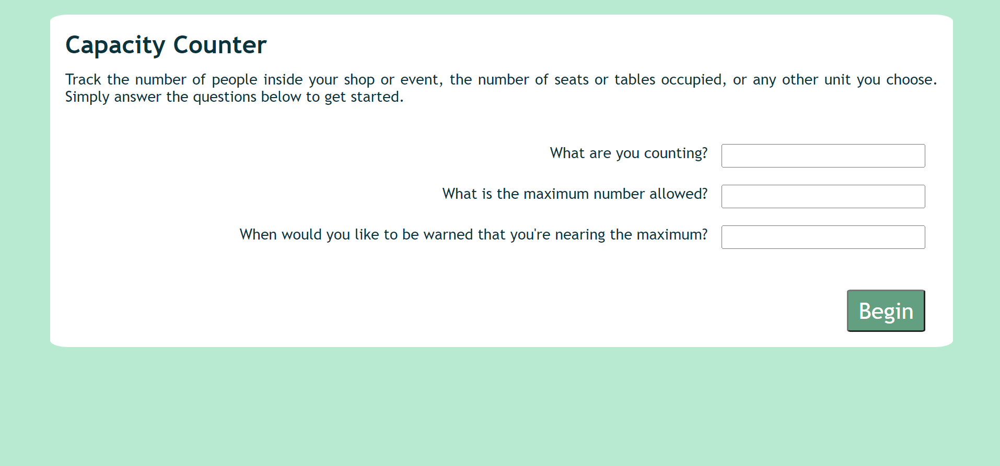  
  
There are a number of requirements to ensure the user's input is logical and usable. Firstly, fields are set to their appropriate types (ie. text and number) and all fields are required before the form can be submitted. Secondly, the maximum number allowed (maximum capacity) must be greater than zero.  
  
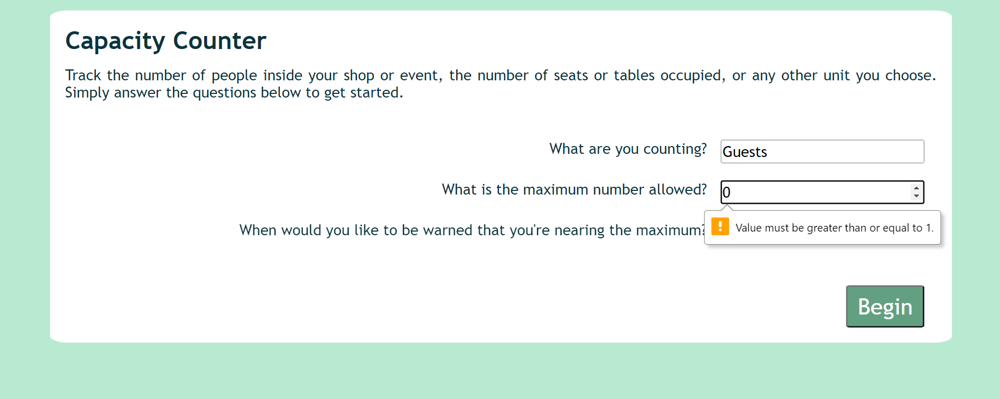  
  
Thirdly, the point at which the user is warned they are nearing capacity must be lower than the maximum capacity itself.  
  
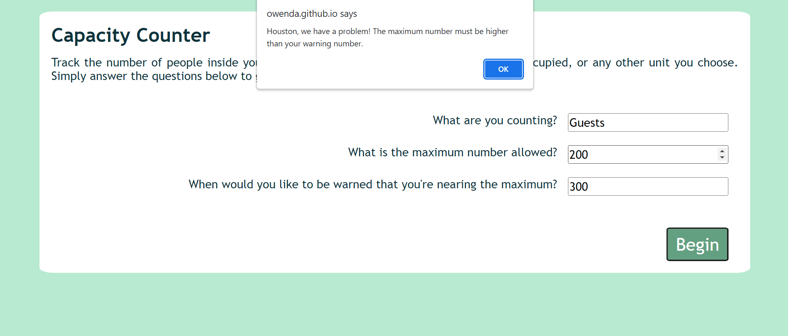  
  
This information forms the parameters for the second potion of the UI, namely, the counter itself. The counter interface is extremely visually simple, and this is very much by design. This simple appearance ensures that a staff member being handed control of the UI is not visually overwhelmed and can immediately intuit its use. During all-day events or busy work shifts, the ability to operate a smooth handover between colleagues can be vital when a staff member has to leave their post to address a concern elsewhere, offer assistance to a customer or client in need, or simply take their break or finish their shift.  
  
The key information, the current quantity, is displayed in a large and easily legible font size. The description of the units being counted is of lesser importance and is displayed in a suitably smaller font size as a result; however, its presence ensures that the information relayed by the UI remains anchored to the real-world situation it depicts and does not become a purely abstract number in the user's mind. This serves to remind staff members of the reason they are using the tool and the importance of doing so dutifully and accurately.  
  
The large buttons are easily accessed on any device, whether clicking or tapping. Their size also ensures they are easily distinguished while allowing them to be kept in close proximity so that the user does not have to scroll or move away from one control to access another.  

In the UI's initial state, a message to the user is brought into focus (and is announced by screenreaders), instructing the user to use the plus and minus buttons below to control the counter. This ensures screenreader-users are aware of the tabbable buttons and understand their context before tabbing to activate either button.  
  
Focus is removed from the message once the user initiates some other action. This message is not shown again even if the user returns the count to zero, as these instructions do not require repetition.  
  
  
  
 A new message appears in this area, between the count (above) and the buttons (below), once the system is in use. This message relays feedback to the user, appropriate to the UI's state at any given moment in relation to the parameters set by the users. `aria-live = "assertive"` is used to ensure that a screenreader will announced changes to this message, ensuring that the user is given an up-to-date count each time they activate the plus/minus buttons.    
   
  
  
 For example, when the current quantity is below the user's threshold(warning number), the message reads reassures the user that all is well and relays the precise number of units remaining before reaching capacity. This "remaining" number allows the user to plan ahead. For example, before admitting a party of ten, the user can glance at the UI and determine whether or not this will exceed capacity. Without this feature, the user would be entirely dependent on their choice of threshold(warning number), and might unwittingly enter the warning state and even the at-capacity or over-capacity states while admitting a larger than average group.  
  
In addition to the changing content of the message, the colour scheme of the UI changes according to its state in relation to the user's parameters. The colour scheme used is inspired by that of a traffic light, although softer on the eye, as this is a convention many users will be familiar with and intuitively understand. The use of the traffic light theme is also emblematic of the tool's similarity to a traffic light, being not unlike a simple fixed state machine in its operation:  

When the current count is below the threshold, the UI uses a soft green background and contrasting dark-grey font colour; this can be referred to as the "green state". From the threshold to maximum numbers, the UI enters an "amber state" with an amber background and an unchanged font colour.  
  
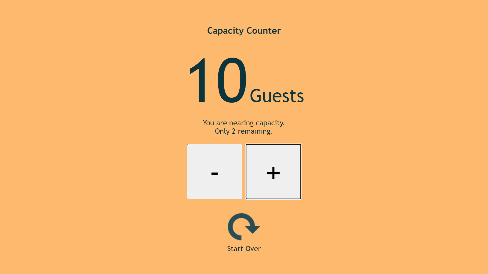  

At the point of capacity, the UI enters a "red state" with a soft red background and a deep red font colour.  
  
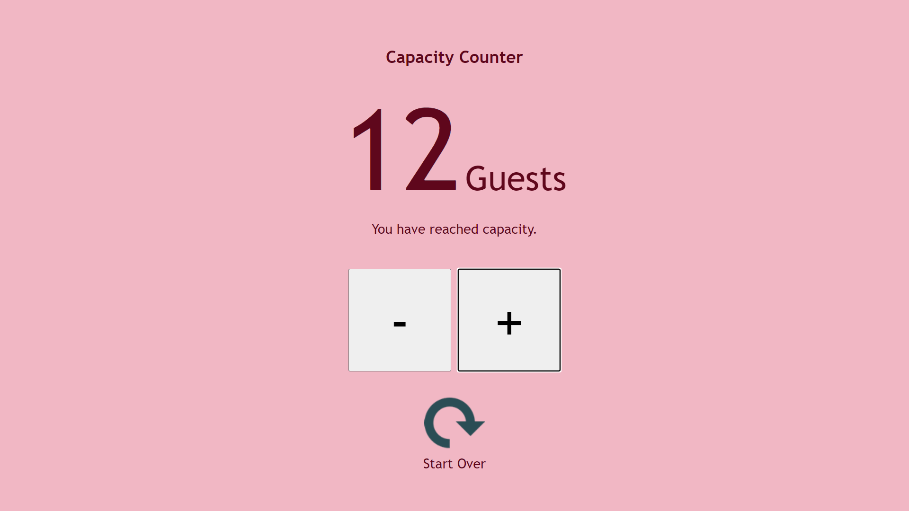  
  
When capacity is exceeded, the UI's background colour becomes a more vivid shade of red and, in order to maintain legibility and contrast, the font colour changes to solid black. In addition, a thick black border is added to the message, ensuring the user is aware that its content has changed. This is akin to an error state but should not cause the UI to stop functioning; rather, it should encourage the user to correct the real-world error, namely, having more units present than can be accomodated. In some situations, this may be easily corrected by asking the last admitted patrons to wait a moment or by having non-essential staff leave the facility, for instance.
  
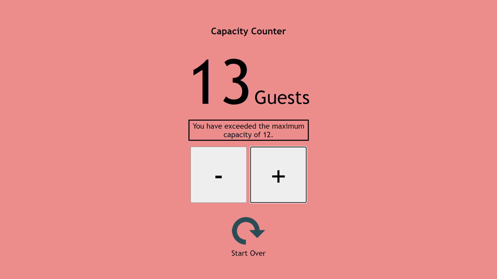
  
Each of these states is reversible. This means that, in situations where the count can logically decrease (such as patrons exiting a store), the user can decrease the count and restore the previous state(s) accordingly. However, the count cannot descend below zero as this would be illogical in the scenarios for which the tool is intended. If the user attempts to decrease the count below zero, the action is disallowed and an error message is displayed.  
  
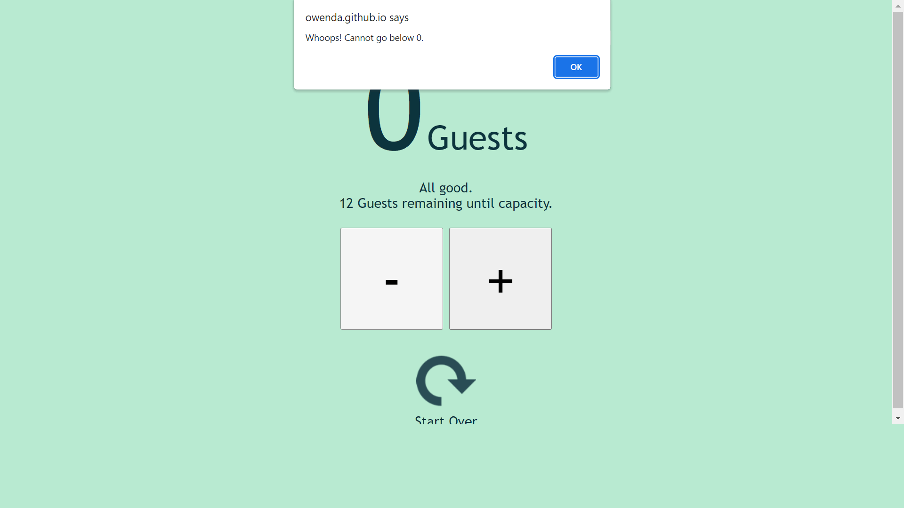  
  
Should the user wish to begin again with new parameters, they can make use of the "Start Over" reset button. This control is tabbable and responds either to a click or, when in focus, the Enter key. To reduce user error, a confirmation message is shown ensuring the user understands that this action will erase their current settings and begin from scratch.  
  
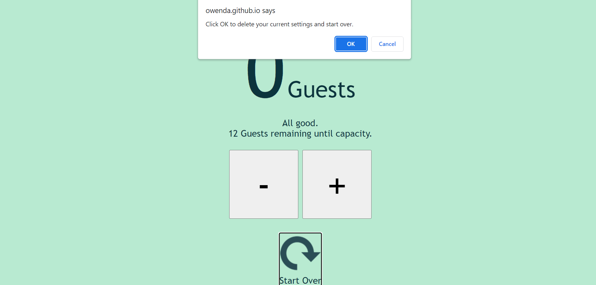

## Testing  
### Manual Testing  
In large part, testing was carried out manually through the development process, checking that each function worked as expected and checking whether various user behaviours or choices were appropriately handled.  
  
As part of this ongoing testing, a testing branch was created to minimise disturbance of the deployed page for changes that required repeated trial-and-error.  
  
### User Testing  
User testing was carried out by students and alumni of [Code Institute](https://codeinstitute.net).  
  
### Accessibility Testing
For testing the contrast level of the various background and font colours used, [Coolers.co](https://coolors.co/contrast-checker) was employed, and in actual fact, the colours that Coolers uses for its own error communication (insufficient contrast) were adopted as the perfect balance for the "red state" (at capacity) that the developer had in mind.  
  
The developer manually tested to ensure that all features can be navigated via keyboard.  
  
[NVDA](https://www.nvaccess.org/) is a freely available screen reader and was used at various stages of development to ensure the UI operates is usable in conjunction with a screen reader. In reality, many screen-reader users do not have JavaScript enables, however, the developer wished to ensure those who do have JavaScript enabled could operate the Capacity Counter.  
  
Although the content is, in fact, created in a single HTML page, the screen reader will regard the two distinct phases (input and counter) of the tool's use as if they were entirely separate pages. That is to say, the user will hear the site name and introductory paragraph as one might expect, followed by the labels and standard descriptions for each input. This is followed by the announcement of the Begin button. No further content is read or announced until the form is submitted (except the user's own input being read back to them as a standard feature of a screen reader, as well as any error messages or prompts).  
  
Once the form has been submitted, the user will hear a prompt to use the buttons to control the counter. Both the increase and decrease ("+" and "-" respectively) can be accessed via the tab key. When a button is clicked, the screen reader announces both the current quantity and the content of the message (e.g. "All good. 17 seats until capacity"). An aria-live attribute is set to "assertive" by the JavaScript code, ensuring that the user is continually and immediately updated at the status of the UI changes. For example, when clicking the increase button 3 times rapidly, the screen reader will not attempt to finish each announcement but will instead interrupt itself to provide the latest status.

### Validators & Tools 

JavaScript code was run through [JSHint.com](https://jshint.com) with no errors or warnings.  
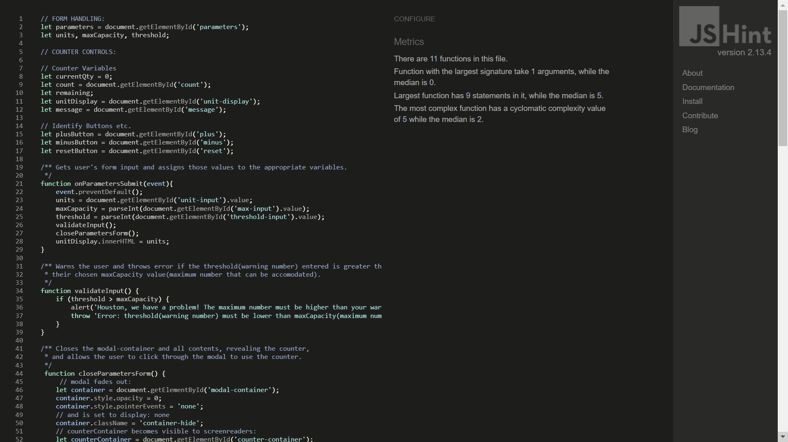  
  
In addition, JavaScript code was also run through [jsvalidator.com](https://jsvalidator.com/) with no errors or warnings.  
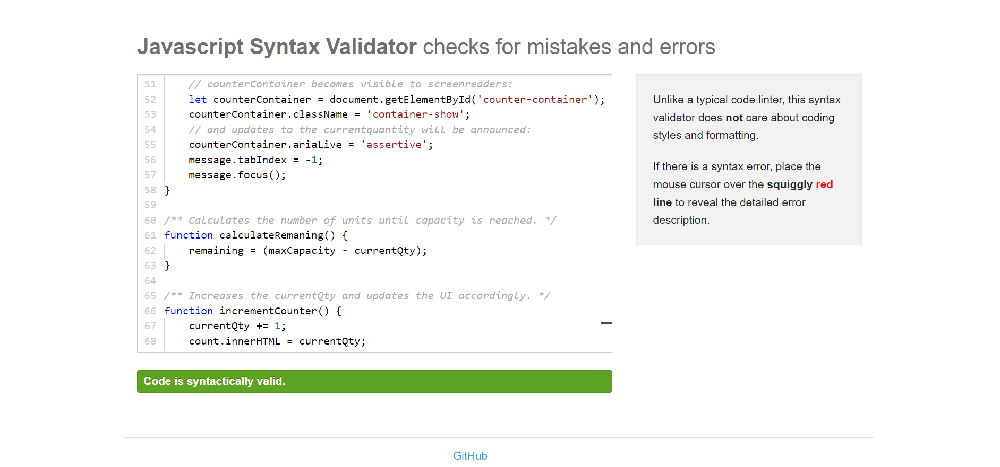  
  
Both CSS and HTML were validated through the W3C's official validators. There were no errors in the CSS and the only warnings present were identifying vendor extensions added via [Autoprefixer](https://css-tricks.com/autoprefixer/) to improve browser compatibility.  
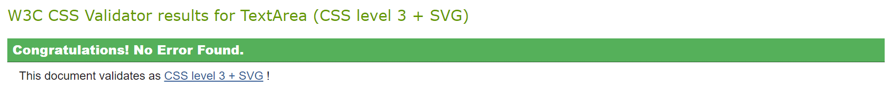  
  

    

  
  
HTML was also found valid, with the only error being the lack of `alt` attribute on the reset arrow image. This omission is very much by design as the image is purely decorative (and `aria-hidden` is set to `true` as a result), and it forms part of a clickable-div which is appropriately announced by a screenreader with the phrase "Clickable: Start Over". The term "clickable" is added by the screenreader itself, while the phrase "Start Over" is drawn from the text content of the div. Alt-text in this instance would be redundant and potentially confusing.  

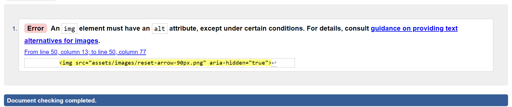  
   
[Google's Lighthouse tool](https://developers.google.com/web/tools/lighthouse) in Chrome's Dev tools was used to generate scores on Performance, Accessibility, Best Practices and SEO. In each case, the site was scored 100.  
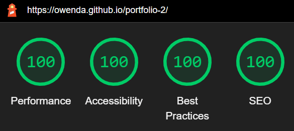  
  

## Deployment

Click to Expand: Deployment Procedure

   

The site was deployed to GitHub pages using the following procedure:
1. Select the repository within the developer's GitHub account (previously set to public)
2. Select "Settings".
3. Navigate to the "Pages" section within "Settings".
4. Under the heading "Source", select "Branch:main" (set to "None" by default).
5. Deploy page to GitHub pages (note: there may a delay of several minutes before a site can be viewed at the link then provided by GitHub).  

### Forking & Cloning Repositories  
Forking a repository allows one to make a copy with which to experiment without affecting or jeopardising the original. This does not require any special permissions from or direct contact with the original developer provided the repository in question is public rather than private. You may wish to do this either to experiment with and learn from another party's code or aid in improving an open-source project by offering changes (note that forking is distinct from [branching](https://docs.github.com/en/pull-requests/collaborating-with-pull-requests/proposing-changes-to-your-work-with-pull-requests/about-branches)). To do this, one must have a GitHub account and be logged in. Then, simply visit the main page of the repository in question, and select the "Fork" option located in the upper-right corner (desktop) as shown in the image below. [Learn more about forks from GitHub Docs](https://docs.github.com/en/get-started/quickstart/fork-a-repo#forking-a-repository).  
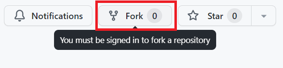 

Forking a repository does not create locally-stored copies of its files on your computer. To achieve this, you will also need to Clone the repository. For example, you may wish to do this if you wish to have a functioning copy of another party's code in under to compile and execute it locally. Cloning options are found under the "Code" drop-down button of a repository's main page, as shown in the image below. [Learn more about cloning from GitHub Docs](https://docs.github.com/en/get-started/quickstart/fork-a-repo#cloning-your-forked-repository).  
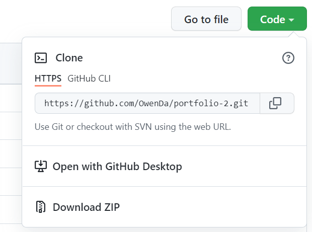  

  
  
## Acknowledgements  
1. Favicon via [WebsitePlanet.com's Favicon Generator](https://www.websiteplanet.com/webtools/favicon-generator/).
2. Although it differs somewhat, the mechanics for the modal window can be credited to this [video tutorial by Florin Pop on Youtube](https://www.youtube.com/watch?v=XH5OW46yO8I).  
3. As mentioned in [Testing](#testing), thanks are owed to students and alumni of [Code Institute](https://codeinstitute.net) for user testing.
4. The developer's mentor is also owed thanks, as is [Code Institute](https://codeinstitute.net).
5. The exact colours used in the UI's "red state" were chosen based on a colour pairing used on the site [Coolers.co](https://coolors.co).  
6. [Stack Overflow](https://stackoverflow.com/) was consulted several times, largely to verify syntax.  
7. As indicated by the automatically generated credit preserved in the CSS file, the CSS code was prefixed by [Autoprefixer](https://autoprefixer.github.io).  
8. This [Nathan Sebhastian article concerning confirmation dialogs](https://sebhastian.com/javascript-confirmation-yes-no/) was used for reference in setting up the reset option.  
9. The image used to accompany the "Start Over" reset option was found via [iconfinder.com](https://www.iconfinder.com/icons/383083/refresh_reload_icon).